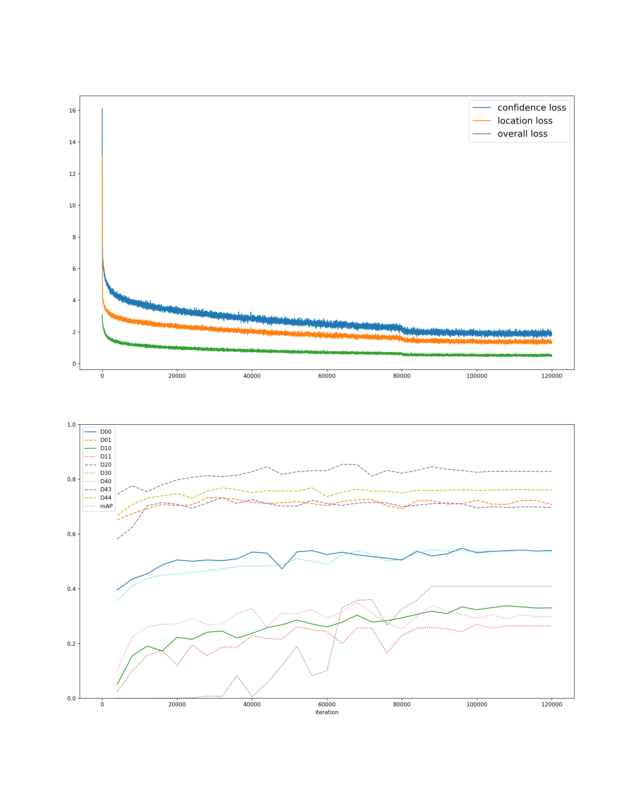

## 実行環境


| Name         | Configuration                   |
|:-------------|:--------------------------------|
| OS           | Manjaro Linux                   |
| CPU          | Intel Core i7-6700              |
| RAM          | 64GB                            |
| GPU          | TITAN X (Pascal)  Memory 12GB   |
| GPU Driver   | nvidia-390                      |
| CUDA Version | 8.0                             |

## 環境設定

依存パッケージのダウンロードやデータのダウンロード・展開は全て自動で行われる．

```
git clone https://github.com/PasonaTech-Inc/anomaly_detection.git
cd anomaly_detection
./setting-environment.sh
git checkout ssd300-vgg16-all-v0.1
```

## 学習

```
python3 train.py --gpu <gpu id>
```

## 実行

学習済みモデルを用いる場合はモデルファイル([link](https://drive.google.com/drive/folders/1yR-kJqier3tIOuawdS9b9OlJGEaIGF4y?usp=sharing))をダウンロードしておく．

```
python3 demo.py --gpu <gpu id> --pretrained_model models/all/ssd300-vgg16-v0.1/model.npz <path to image>
```

## 学習の設定

学習・実行用のコードはChainerCVの[SSD](https://github.com/chainer/chainercv/tree/master/examples/ssd)に基づいている．

| label        | configuration           |
|:-------------|:------------------------|
| architecture | SSD300 (based on VGG16) |
| iteration    | 120000                  |
| optimizer    | MomentumSGD             |
| batchsize    | 32                      |

### データ
データの詳細は[wiki](https://github.com/PasonaTech-Inc/anomaly_detection/wiki/Road-Damage-Dataset)に書かれている．  
RoadDamageDatasetの全ての地区のデータをマージし，学習と評価に用いている．  
学習には全地区のtrainをマージしたものを，評価には全地区のvalデータをマージしたものを用いている．

### learning rate
初期値は 5e-04 としている．ExponentialShiftにより 80000 iteration と 100000 iteration において学習レートが変化する．

| iteration | learning rate |
|:----------|--------------:|
| 0~        | 5e-04         |
| 80000~    | 5e-05         |
| 100000~   | 5e-06         |

### 評価
学習時に 4000 iteration ごとに評価を行っている．  
評価基準は Pascal VOC に準じており，各クラスにおける Average Precision と全クラスに対する mean Average Precision を計測している．

## 学習結果
図上部が iteration に対する loss の経過，図下部が各クラスに対する Average Precision と，全クラスに対する mean Average Precision である．


