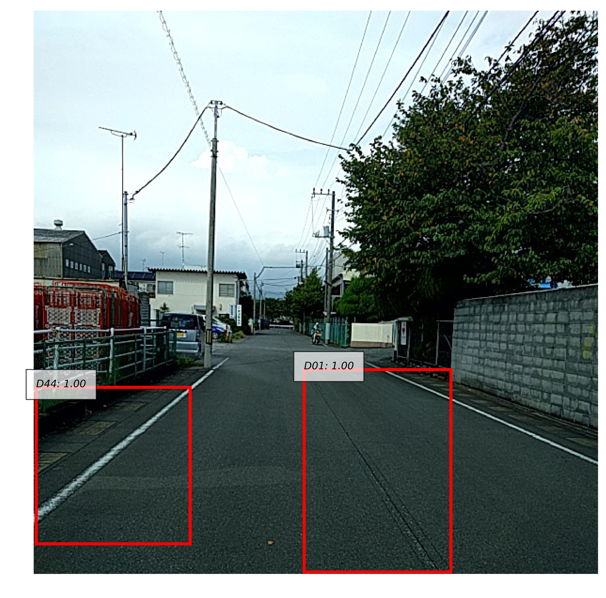
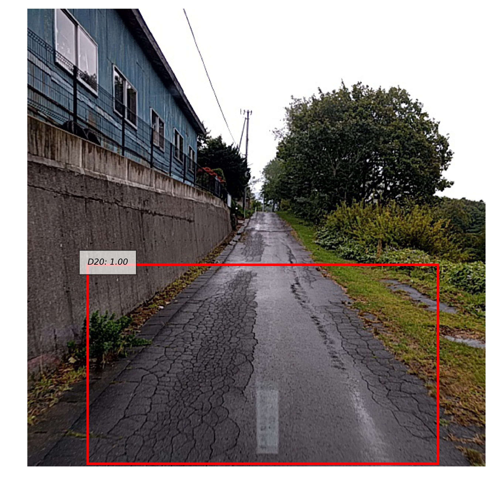
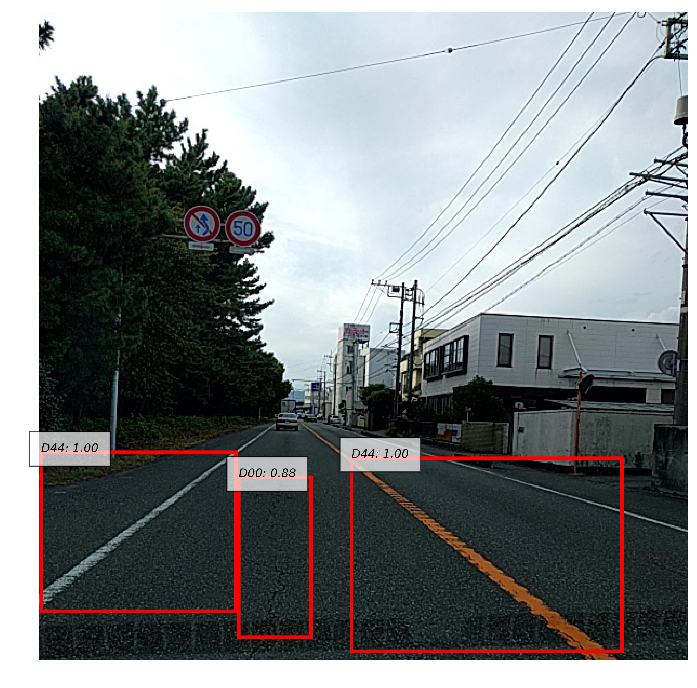
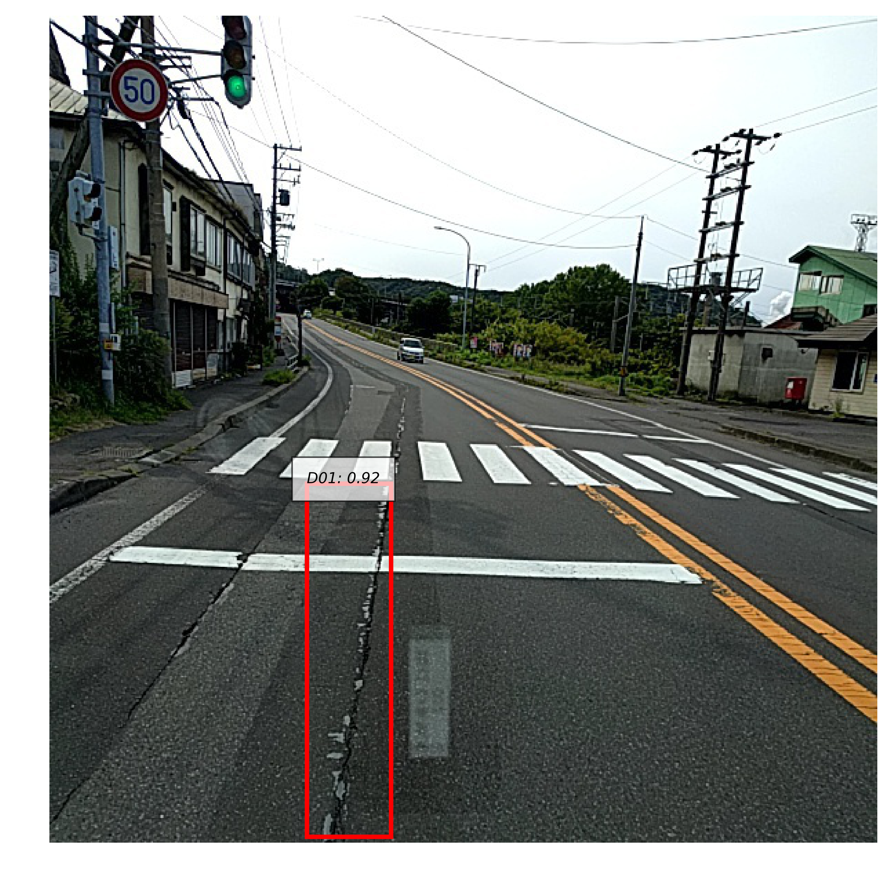

RoadDamageDetector in Chainer
=============================

[RoadDamageDetector](https://github.com/sekilab/RoadDamageDetector)を参考にした道路損傷検出モデルのChainerによる実装

道路のひび割れやセンターラインのかすれなどを検出することができる．  






データセットは[CC BY-SA 4.0](https://creativecommons.org/licenses/by-sa/4.0/deed.en)ライセンスのもとで配布されている．
<a rel="license" href="http://creativecommons.org/licenses/by-sa/4.0/deed.en"></a>  

<br />

詳細は以下を参照

* [Qiita](https://qiita.com/IshitaTakeshi/items/915de731d8081e711ae5)
* [GitHub wiki](https://github.com/IshitaTakeshi/RoadDamageDetector/wiki)

# 環境設定

依存パッケージのダウンロードやデータのダウンロード・展開は全て自動で行われる．

```
git clone https://github.com/PasonaTech-Inc/anomaly_detection.git
cd anomaly_detection
./setting-environment.sh
```

# 学習

## 識別器の学習

基本的には以下のコマンドですぐに学習が行えるようになっている．

```
python3 train_detector.py --base-network <vgg16 or resnet101> --gpu <gpu id>
```

GPU IDに負の値を指定すればCPUで実行することもできる．

その他のオプションは

```
python3 train_detector.py -h
```

で確認できる．


### ResNet-101を用いる場合
ベースネットワークとしてResNet-101を用いる場合は，Caffeの学習済みモデルを自分でダウンロードする必要がある．  
方法は[Chainerのドキュメント](https://docs.chainer.org/en/stable/reference/generated/chainer.links.ResNet101Layers.html)に記述されている．

## ベースネットワークの学習 (ResNet-101のみ)
精度向上の試みとしてベースネットワークそのものを事前に学習することができる．この機能は現在ResNet-101のみに対して有効である．

```
python3 train_extractor.py --gpu <gpu id>
```

得られたモデル`model-extractor.npz`を`--pretrained-extractor`オプションで指定することで，学習済みのベースネットワークをSSDに組み込むことができる．

```
python3 train_detector.py --base-network resnet101 \
                          --gpu <gpu id> \
                          --pretrained-extractor model-extractor.npz
```

# 実行
学習済みモデルを用いる場合はモデルファイル([link](https://drive.google.com/drive/u/0/folders/1T_LwA8sjK_yoE7Z7Hv22Dz20G-GNxn1Z))をダウンロードしておく．  

```
python3 demo.py --base-network <base network> \
                --gpu <gpu id> \
                --pretrained_model models/ssd300-vgg16-v0.1/model.npz <path to image>
```

学習時と同様に，GPU IDに負の値を指定すればCPUで実行することもできる．

## データ
データの詳細は[wiki](https://github.com/IshitaTakeshi/RoadDamageDetector/wiki/Road-Damage-Dataset)に書かれている．  
RoadDamageDatasetの全ての地区のデータをマージし，学習と評価に用いている．  
学習には全地区のtrainをマージしたものを，評価には全地区のvalデータをマージしたものを用いている．
